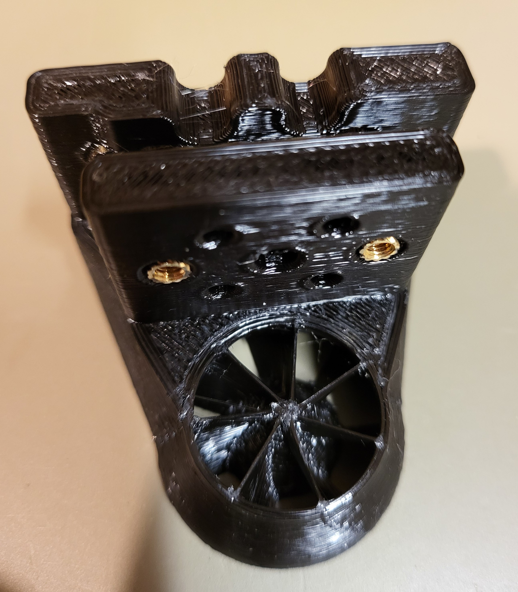
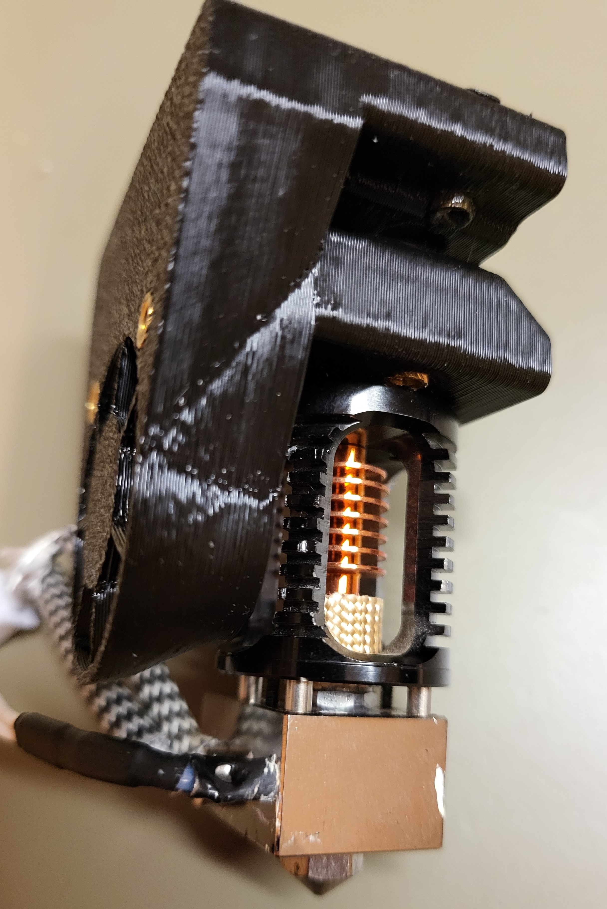
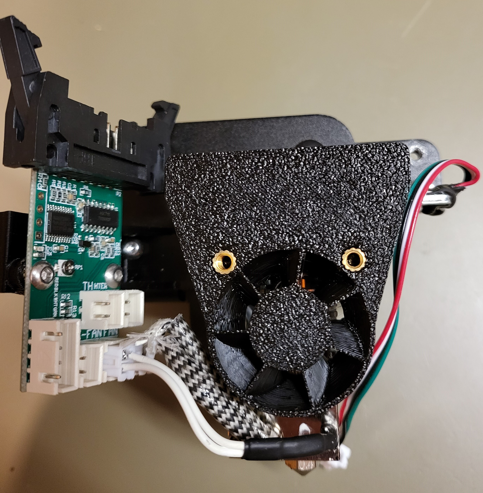
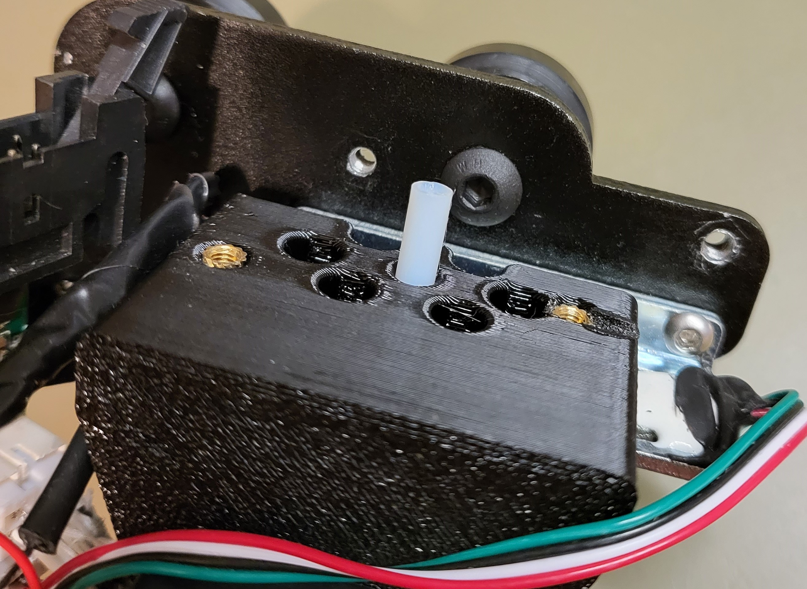
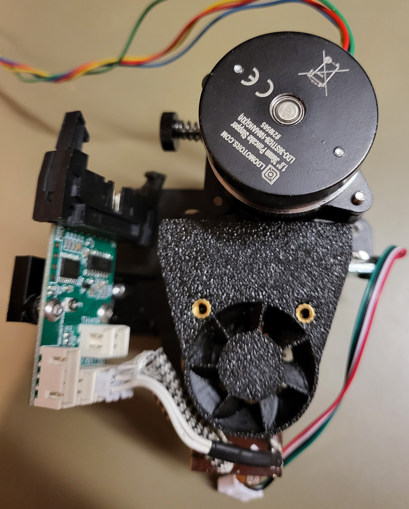

TOC

- [A little to the history of the mount](#a-little-to-the-history-of-the-mount)
- [Printing](#printing)
- [Mounting instructions](#mounting-instructions)
- [Difference between V1 and V2](#difference-between-v1-and-v2)

# A little to the history of the mount

The Dragon + Orbiter mount has gone trough a few variations. The main idea stayed however the same.

The last update introduced a hotend cooling fan stator after a report of the fan stalling causing jamming of the hotend. The fan stall situation could be reproduced by just reducing the stock Creality fan power to 20V and hence this was way too close to the problem zone not to address. Both Sunnon 3010 fans I have did not show any stalling.

I do not want to take off the fan shroud (which would solve the hotend clogging issue) because that will cool the melt zone and decrease extrusion performance. A known technique to avoid stalling of axial fans is to add a stator to clean up the airflow. A series of different stator designs in combination with varying outlet diameters has been tested and the best one chosen. The airflow is now higher and more directed than without a shroud. 

# Printing

Print in PETG or higher Tg material. PLA might not be sufficient as the fan shroud comes too close to the heater block.

* 2 outer layers and 2 top and bottom layers
* Alternating layer with infill
* Connected infill lines

(minimum required, more layers may be used)
* Infill: 20% gyroid
* layer height 0.24 mm
* line width 0.45 mm
* print 5 to 10 °C hotter than usual to improve layer bonding
* reduce fan speed to improve layer bonding
* no supports needed

* make sure horizontal expansion is not enabled!!! otherwise the stotor will not slice correctly.

# Mounting instructions

6 M3 x 7 mm hot melt inserts are needed (the 2 hotmelts for the fan may be shorter). The 2 hot melts for the extruder are inserted from the top, the 2 for the strain gauge mount from the bottom of the mount block. The 2 hot melt inserts in the bottom might have some plastic on their tips. This can be cleaned up wiht a drill or by inserting a screw from the bottom. Turn this screw all the way trough to clear the small amount of plastic that accumulated in the screw path.width="60%"

Bolt the hotend to the block using the 4 longer M2.5 bolts provided with the hotend.The M2.5 bolts drop trough the mount block. The heater block should be turned 90° to the left such that the fan shroud will later on fit around it.

Now mount the block to the strain gauge with M3 x 14 mm bolts. Be carefull not to use to long bolts as they will end up against the hotend.

Insert a 33 mm PTFE tube (the path is 33.5 mm long make sure the tube is just a little shorter). Push the tube down so it seats into the little recess in the top of the hotend. The top of the piece sticking out is best to cut a small taper to make it easier to insert filament (avoid filament from pushing to the top of the PTFE tube).

Mount the extruder with two M3 x 10 bolts (an M3 x 12 would risk damaging the strain gauge sensor under the white glue on the left side).

# Difference between V1 and V2

V1 had a slight misalignment in the nozzle position (1.3mm too high) versus the stock CR6 hotend. In V2 this has been corrected. For any new installation please use V2. If you have a V1 mount use the V1 shroud, it is identical except 1.3 mm higher positioned outlet to accommodate the misalignement.

The mount present now is the one for hot melt inserts. The one using nuts will follow soon.

The distance between the Orbiter and Dragon where a piece of PTFE tube is needed is 33.2 mm. Use a tube that is 1mm shorter (~32mm). It should not be compressed between the hotend and exruder which would cause it to deform and possibly hinder filament flow.

Mounts to install the Dragon hotend and Orbiter extruder directly on the CR-6 SE amd MAX strain gauge.

The 5015 part fan mount has been designed after a lot of iteration with the help of Alex. The idea is that it comes very close to the build plate and surrounds the sock with about 1 mm in order to push as much air as possible close to the nozzle. The roudings at the sides are to ensure the air is pushed back inwards behind the nozzle to also cool the freshly laid plastic when the nozzle moves towards the fan shroud.
This  is believed to be more effective than a twin fang design where both airflows will inevitably collide and cause certain angles to get little to no airflow ar all.

Printed in PETG the fan shroud has been tested with the hotend at 300 °C with the nozzle at 0.2 mm from the hot bed at 110 °C wiht the part fan itself off.

